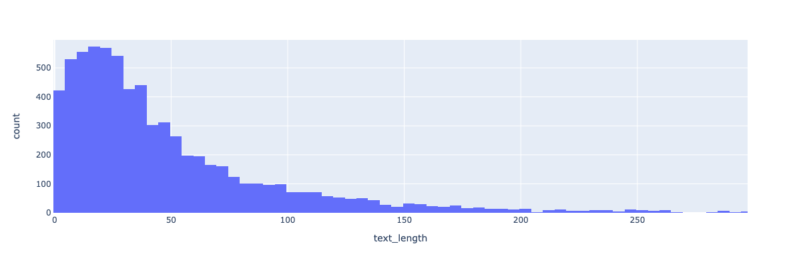

# iMessages

A simple exploration of iMessages using python. 

### Motivation

It was my colleague's birthday, and since we had corresponded frequently regarding assignments and other project or meeting related issues, it would be fun to do a brief analysis of our text messages. 

## Procedure

- The iMessages chat database file can be found in the /Users/your_username/Library/Messages/chat.db
- I used the sqlite3 library to connect to the database, and the cursor.execute("SQL QUERY") method to query all columns of the "messages" table to explore the features.
- The key feature is the handle_id, which indicates the user or group your message is sent in. It is a handle that is assigned to every "conversation" or "thread" you are in. So if you have a conversation with person A, a separate conversation with person B, and a group chat with both of them, there will be three total handle_id numbers, which start from 1. 
- I did a specific text search to identify my colleague and narrowed down the possible handle_ids, then filtered for only their handle_id, which turned out to be 1326. Then it's straightforward EDA to find insights.

## iMessage Idiosyncratic Behavior

In iMessage there are several features to take into account that are not present in other more rudimentary messaging apps. 

- the "tap back" feature of reacting to a message counts itself as a reaction. Therefore with knowledge of the specific language like "liked" or "emphasized" you can filter by tapback type.
- If you play an in-app game like "cup pong", launching the instance will register as a message. If games are turn based, then you can have additional analysis (like how many games were played during meetings)

## Insights

**Totals:**

- The total "messages" sent was 6836. But this metric would be better called "interactions" because of the many non-text items which are mentioned above. 
- The average message was 49 characters long (for reference, roughly the same number of characters in this bullet point that appear before this parenthetical). However, the data has a significant right skew, and the median is 33 characters. Some examples of 33 character length messages:
	- "I really like that color palette!"
	- "Omg it’s been 30 minutes only 😭😭😭"
	- "Get best model and print results?"
- The longest message was a copy + pasted song lyrics from a parody song I wrote and performed at our graduation ceremony. It was 2890 characters long, so understandably skewed the data. The differences can be seen in figures 1 & 2 below. 

**Split by individual:** From the feature "is_from_me" I could easily find the percent of messages sent by each person. 

- I sent 42% of the messages, with my colleague sending 58%. 
- My messages had median character length of 47, with my colleague's had 28 characters.
	- Example of 47 character message sent by me: "Can you send me your résumé？I need inspiration"
	- Example of 28 character message sent by my colleague: "Let me do this real quick!!!"
- Despite sending the few number of messages, I still sent more characters total due to the longer average text length. 

**Games:**

- 15 instances of "Cup Pong", but I did not cross reference to find if any occurred during essential work duties. Anecdotal evidence suggests at least two occasions. 

**Tap-Backs:**

- There were 112 instances of using the "HaHa" tapback. 

## Conclusion

As is evident from a brief sampling of messages, the data indicates that my colleague sends more frequent and shorter messages, but I send slightly less ferequent but more verbose messages. I tend to use more punctuation and parentheticals rather than splitting up messages. Many instances of "ha" were found, which indicates levity in the working relationship. Several games of Cup Pong were played, indicating my colleagues obsession with cup pong, and my acquiescence. 

## Future Expansion

- I can imagine organizing my queries into sections which return the metrics of interest, and then allowing the user to specify the path to their imessages database (or generating it through a system function call)
- Having the plots showing up on a dash app depending on the query.
- Comparing two different users and what the interactions could be interesting.
- Using the messages to infer relationships, for instance:
	- high frequency messages but low length might indicate a work relationship
	- a sudden drop in frequency of messages but with consistent correspondence at a new lower value could indicate more time spent together in person
	- Frequent longer messages could indicate relational closeness but geographic distance, or a time conflict meaning connection has to be more verbose in a shorter time, or sent through updates which capture more events. 
	- Frequent messages dropping to near zero can indicate some life transition such as moving jobs, moving to a new home, breaking up, or conflict which has ended the relationship.  
- Given a chat.db file and a user_handle, can we infer some interesting hidden patterns in the relationship?
	- For instance "here is a list of friends who always text you first"
	- "Here is a list of friends who almost never initiate with you"
	-  One useful metric might be "response time" if you need help from a friend, you might want to know when you can expect to hear from them. 

 
 

